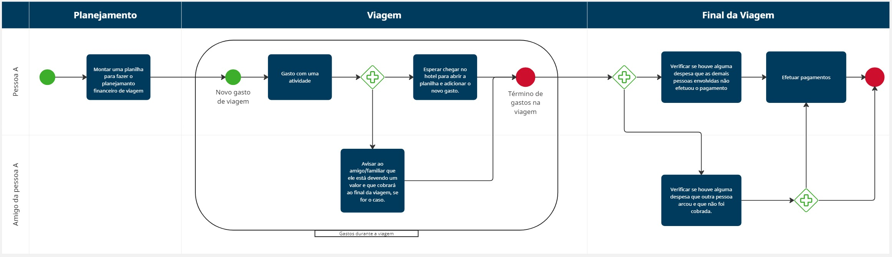
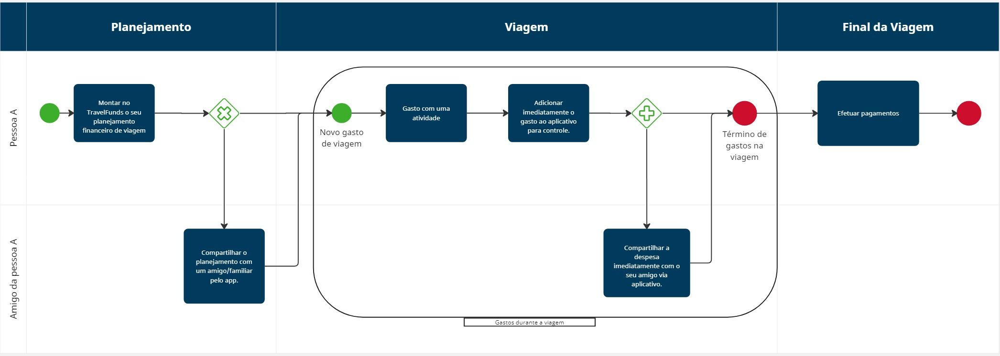
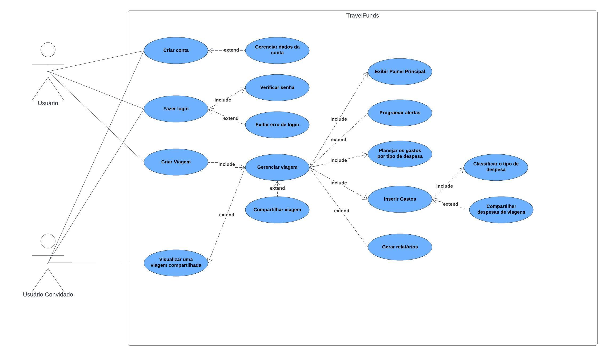

# Especificações do Projeto

 A definição do problema e dos principais pontos a serem discutidos neste projeto foram baseados em informações obtidas em entrevistas com usuários conduzidas pela equipe de trabalho. Os detalhes levantados ao longo desse processo foram consolidados na forma de personas e histórias de usuários. 
  

## Personas

**Quadro 1 – Entrevista com a primeira persona** 

|  | **Ricardo**   50 anos|
|:---------------------------------------:|:-------------------------------:|
|**Profissão** | Arquiteto |
|**Motivação** | Pretende sair de férias com sua esposa e seus quatro filhos por 2 semanas. |
|**Comportamento** | Desde que começaram a planejar a viagem, passou a guardar uma parte de seu salário com o objetivo de pagar as passagens e hospedagem e também possuir uma reserva de dinheiro para os gastos durante a viagem. |
|**Desafio** | Ricardo tem uma família grande que gosta de comer em bons restaurantes e passear bastante. Por mais que tenha um bom salário e a possibilidade de levar uma boa quantia de dinheiro para a viagem, ele se preocupa com os excessos que podem acontecer. Seu desafio será manter os gastos de viagem dentro do orçamento previsto e não precisar recorrer ao cartão de crédito, para evitar taxas extras como o IOF, por exemplo. |

**Fonte:** Elaborado pelos autores. 

**Quadro 2 – Entrevista com a segunda persona** 

|  | **Eduardo**   29 anos|
|:---------------------------------------:|:-------------------------------:|
|**Profissão** | Garçom |
|**Motivação** | Quer planejar sua lua de mel. |
|**Comportamento** | Costuma guardar parte do salário de forma irregular. Diz não conseguir contribuir com a poupança todo mês, tanto porque seu salário não é alto e imprevistos acontecem, quanto porque, às vezes, ele esquece de guardar.  |
|**Desafio** | Eduardo não é muito organizado financeiramente e acaba se enrolando em alguns meses por gastos excessivos no mês anterior, o que compromete o planejamento de sua viagem. Seu desafio será ter disciplina para guardar dinheiro todo mês, independente da quantia disponível. Importante ter um lembrete mensal para lembrá-lo disso.  |

**Fonte:** Elaborado pelos autores. 

**Quadro 3 – Entrevista com a terceira persona** 

|  | **Amanda**   25 anos|
|:---------------------------------------:|:-------------------------------:|
|**Profissão** |  Empreendedora |
|**Motivação** | Viajou com duas amigas para fora do país. |
|**Comportamento** | Amanda e suas amigas decidiram fazer um orçamento compartilhado para a viagem. Por ser mais organizada financeiramente, ela arcou com a maior parte dos gastos e utilizou o aplicativo para manter anotado cada coisa que ela pagou. |
|**Desejo** | Amanda deseja que o aplicativo gere um relatório dos gastos da viagem que foram anotados, para que ela e as amigas fiquem cientes do total e para que possam fazer a divisão das despesas entre si. |

**Fonte:** Elaborado pelos autores. 

**Quadro 4 – Entrevista com a quarta persona** 

|  | **Adriana**   45 anos|
|:---------------------------------------:|:-------------------------------:|
|**Profissão** | Coordenadora de equipe de vendas |
|**Motivação** | Quer planejar uma viagem de trabalho da sua equipe composta por 10 pessoas. |
|**Comportamento** | Adriana está responsável pela primeira vez pela viagem de trabalho da sua equipe. Ela precisa comprar passagens, garantir hospedagem e alimentação para 10 pessoas e apresentar o orçamento para seu chefe e para o departamento financeiro da empresa para ser aprovado. |
|**Desafio** | Adriana precisa montar o menor orçamento possível sem que prejudique os direitos dos funcionários. |

**Quadro 5 – Entrevista com a quarta persona** 

|  | **Carmem**   65 anos|
|:---------------------------------------:|:-------------------------------:|
|**Profissão** | Assistente Social aposentada |
|**Motivação** | Usufruir da aposentadoria, explorando novos lugares com suas amigas e criando memórias especiais. |
|**Comportamento** | Carmem é uma pessoa organizada financeiramente e muito prudente com suas finanças. Ela tem um rendimento fixo advindo da aposentadoria e valoriza cada gasto, pois representa uma oportunidade de desfrutar de forma mais completa da sua fase de descanso. Carmem precisa economizar durante suas viagens. Ela também não tem intimidade com a tecnologia e utiliza o seu dispositivo móvel apenas para atividades básicas. |
|**Desafio** | Uma aplicação intuitiva e de fácil uso mesmo para quem não tem muitos conhecimentos tecnológicos. Ademais, que a aplicação simplifique o rastreamento das despesas da sua viagem.|

## Histórias de Usuários

Com base na análise das personas forma identificadas as seguintes histórias de usuários:

**Quadro 6 – Histórias de Usuários** 

|EU COMO... `PERSONA`| QUERO/PRECISO ... `FUNCIONALIDADE` |PARA ... `MOTIVO/VALOR`                 |
|--------------------|------------------------------------|----------------------------------------|
|Ricardo | Manter gastos de viagem dentro do orçamento previsto           | Evitar gastos excessivos               |
|Eduardo | Configurar contribuições mensais           | Contribuir regularmente com a poupança de viagem               |
|Eduardo | Ajustar metas de economia          | Caso haja mudanças em suas circunstâncias financeiras              |
|Amanda  | Gerar relatório de gastos de viagem            | Compartilhar com suas parceiras de viagem              |
|Amanda  | Acessar histórico de contribuições passadas           | Revisão de progresso             |
|Adriana | Gerar relatório de gastos em formato PFD após a viagem          | Apresentar o documento detalhado para o chefe do departamento financeiro        |
|Carmem  | Aplicação de fácil uso para pessoas com baixo conhecimento tecnológico           | Experiência de uso fácil e acessível     |
|Carmem  | Definir meu limite fixo de gastos subtraindo automaticamente o valor gasto do total disponível           | Tomar decisões conscientes e a evitar excessos

## Modelagem do Processo de Negócio 

### Análise da Situação Atual

 Com o retorno das atividades de viagem após pandemia, observou-se um aumento significativo nos custos associados, refletindo uma realidade onde os preços aumentaram de forma expressiva e a disponibilidade de alternativas acessíveis diminuiu. Nesse contexto, torna-se essencial adotar uma abordagem financeiramente responsável ao planejar uma viagem. O aplicativo proposto irá atender a essa necessidade crescente, oferecendo uma plataforma abrangente que facilita a organização prévia da viagem e proporciona um controle efetivo dos gastos durante o período de passeio. Baseando-nos em dados recentes que indicam a importância do planejamento financeiro para as férias, bem como os riscos associados ao endividamento devido a viagens, o aplicativo visa preencher essa lacuna, ajudando os usuários a tomar decisões financeiras informadas, reduzir o estresse relacionado às finanças durante as viagens e promover uma experiência de viagem mais satisfatória. 

### Descrição Geral da Proposta

 O TravelFunds visa oferecer aos usuários uma experiência mais conveniente na organização prévia de suas viagens. Com este aplicativo, os usuários podem dividir seu planejamento de viagem em categorias abrangentes, proporcionando uma gestão financeira mais eficaz e tranquila. Além disso, para garantir o cumprimento do orçamento planejado, o aplicativo permite que os usuários registrem seus gastos em tempo real para monitoramento. Ele também facilita o compartilhamento de despesas entre amigos e familiares durante viagens em grupo, promovendo uma experiência mais colaborativa e harmoniosa.

 

### Processo 1 – PLANEJAMENTO COM PLANILHAS

 Vimos que o planejamento de viagem é uma etapa fundamental para quem deseja manter um padrão de gastos dentro do esperado e assim não comprometer a sua renda. No entanto, o método tradicional para se fazê-lo não é mais demorado e não oferece a integração e praticidade que o mundo atual exige.

 

### Processo 2 – PLANEJAMENTO COM TRAVELFUNDS

 Sendo assim, com o TravelFunds, é possível compartilhar de forma descomplicada desde o planejamento financeiro da sua viagem com alguém até dividir os gastos realizados durante a viagem, em tempo real com seu amigo ou familiar. É possível outrossim, controlar as despesas no momento em que foram realizadas para que não se esqueça de lançá-las depois, e assim, manter o seu controle na palma da sua mão.

 

## Indicadores de Desempenho

Os principais indicadores de desempenho e metas para o processo estão listadas na tabela a seguir. 
 

|Indicador    | Objetivos  | Descrição | Cálculo | Fonte de dados  | Perspectiva |
|------|-----------------------------------------|----------------------------------------- | ----|  ----|  ----|
| Número de viagens criadas| Monitorar quantos usuários criaram viagens personalizados | Um alto número pode indicar a utilidade percebida do recurso de personalização do aplicativo.|  Número de viagens cadastradas / Número de usuários   | Tabela de viagens |  Cliente| 
| Taxa de conformidade do orçamento| Comparar o orçamento planejado com os gastos reais | Uma alta taxa de conformidade indica que os usuários estão conseguindo manter seus gastos dentro do planejado.|  (Total de gastos reais / Orçamento planejado)*100%    | Tabela de valores |  Cliente| 
| Porcentagem de despesas categorizadas | Identificar quantas despesas são categorizadas pelos usuários em relação ao total de despesas registradas | Uma alta porcentagem indica que os usuários estão utilizando os recursos de categorização do aplicativo, o que pode facilitar a análise financeira. | (Número de despesas categorizadas / Número de despesas cadastradas)*100%  | Tabela de valores |  Cliente| 
| Taxa de aceitação de convites para compartilhar viagens | Comparar a quantidade de convites enviados para compartilhar viagem com os aceitos | Uma taxa alta de aceitação indica que os usuários valorizam a capacidade de compartilhar suas viagens com outras pessoas | (Número de convites acetos / Número de convites enviados)*100%   |    | Cliente| 
| Número de relatórios emitidos| Monitorar quantos relatórios são gerados pelos usuários | Um alto número pode indicar o nível de interesse na análise financeira oferecida pelo aplicativo.| Número de relatórios emitidos / Número de viagens cadastradas   | Tabela de viagens |  Cliente| 

Atenção: as informações necessárias para gerar os indicadores devem estar contempladas no diagrama de classe. Colocar no mínimo 5 indicadores. 
Usar o seguinte modelo: 

Obs.: todas as informações para gerar os indicadores devem estar no diagrama de classe a ser apresentado a posteriori. 

## Requisitos

O escopo do projeto é definido por meio de requisitos funcionais e não funcionais, a fim de descrever todas as funcionalidades que o usuário poderá encontrar, como também os aspectos gerais que precisam ser apresentados pela ferramenta.

### Requisitos Funcionais
Na tabela a seguir estão listados os requisitos funcionais do projeto, bem como a prioridade de entrega de cada item.

**Quadro 7 – Requisitos Funcionais** 

|ID    | Descrição do Requisito  | Prioridade |
|------|-----------------------------------------|----|
|RF-001| A aplicação deve permitir que o usuário crie uma conta | ALTA |
|RF-002| A aplicação deve permitir que o usuário realize login em sua conta utilizando email e senha | ALTA |
|RF-003| A aplicação deve permitir que o usuário gerencie seu perfil | ALTA |
|RF-004| A aplicação deve possbilitar ao usuário criar e gerenciar viagens | ALTA |
|RF-005| A aplicação deve exibir um painel principal que destaca o valor total guardado e o orçamento da viagem | ALTA |
|RF-006| A aplicação deve permitir que os usuários insiram gastos durante a viagem, especificando valor e categoria | ALTA |
|RF-007| A aplicação deve atualizar automaticamente o saldo quando um gasto for inserido durante a viagem | ALTA |
|RF-008| A aplicação deve permitir que os usuários registrem o valor que estão guardando mensalmente para a viagem  | MÉDIA |
|RF-009| A aplicação deve permitir que o usuário configure um orçamento total necessário para a realização da viagem | MÉDIA |
|RF-010| A aplicação deve exibir o progresso em direção a meta de economia final | MÉDIA |
|RF-011| A aplicação deve permirtir que o usuário compartilhe uma viagem com outros usuários | MÉDIA |
|RF-012| A aplicação deve oferecer ao usuário a possibilidade de gerar relatório que exibe gastos por categoria | BAIXA |
|RF-013| A aplicação deve permitir que os usuários programem alertas para poupança mensal e recebam notificações durante a viagem, alertando sobre a proximidade ou ultrapassagem do limite de gastos estabelecido | BAIXA |

### Requisitos não Funcionais
A tabela a seguir especifica os requisitos não funcionais que devem ser atendidos pelo projeto.

**Quadro 8 – Requisitos Não Funcionais** 

|ID     | Descrição do Requisito  |Prioridade |
|-------|-------------------------|----|
|RNF-001| A aplicação deverá ser desenvolvida usando React Native | ALTA |
|RNF-002| A aplicação deverá ser disponivel para o sistema Android | ALTA |
|RNF-003| A aplicação deverá ser disponivel para o sistema IOS | MÉDIA |
|RNF-004| A aplicação deverá ser responsiva, permitindo a visualização em aparelhos mobile de forma adequada | MÉDIA |
|RNF-005| A aplicação deve possuir uma interface simples, apresentando as informações de forma visual e acessível | MÉDIA |
|RNF-006| A aplicação deve estar disponível para acesso a qualquer horário do dia | MÉDIA |
|RNF-007| A aplicação deve processar requisições do usuário em no máximo 5s | BAIXA |

## Restrições

As questões que restringem a execução desse projeto e que refletem as obrigações para o desenvolvimento do trabalho, são apresentadas na tabela a seguir.

**Quadro 9 – Restrições** 

|ID| Restrição                                             |
|--|-------------------------------------------------------|
| RE-01 | O projeto deve ser entregue no final do semestre letivo, sendo 23/06/2024 a data limite. |
| RE-02 | A equipe desenvolvedora deve ser composta apenas pelos alunos que fazem parte do projeto.       |
| RE-03 | O sistema deve estar em conformidade com a Lei Geral de Proteção de Dados (LGPD). |

## Diagrama de Casos de Uso

A imagem a seguir mostra diagrama de casos de uso do projeto, que contempla a fronteira do sistema e o detalhamento dos requisitos funcionais com a indicação dos atores, casos de uso e seus relacionamentos. 

 
<b>Figura 4</b> - Diagrama de casos de uso
  
 

# Matriz de Rastreabilidade

A matriz de rastreabilidade é uma ferramenta usada para facilitar a visualização dos relacionamento entre requisitos e outros artefatos ou objetos, permitindo a rastreabilidade entre os requisitos e os objetivos de negócio. 

**Quadro 10 – Matriz de Rastreabilidade** 

| ID |RF01|RF02|RF03|RF04|RF05|RF06|RF07|RF08|RF09|RF10|RF11|RF12|RNF01|RNF02|RNF03|RNF04|RNF05|RNF06|RNF07|
|----|----|----|----|----|----|----|----|----|----|----|----|----|-----|-----|-----|-----|-----|-----|-----|
|RF01|    | x  |    |    |    |    |    |    |    |    |    |    |     |     |     |     |     |     |     |
|RF02|    |    |  x |  x |  x |  x |  x |  x |  x |  x |  x | x  |     |     |     |     |     |     |     |
|RF03|    |    |    |    |    |    |    |    |    |    |    |    |     |     |     |     |     |     |     |   
|RF04|    |    |    |    |  x |  x |  x |  x |  x |  x |  x | x  |     |     |     |     |     |     |     |   
|RF05|    |    |    |    |    |    |    |    |    |    |    |    |     |     |     |     |     |     |     |   
|RF06|    |    |    |    |    |    |  x |  x |    |    |    |    |     |     |     |     |     |     |     |   
|RF07|    |    |    |    |    |    |    |    |    |    |    |    |     |     |     |     |     |     |     |   
|RF08|    |    |    |    |    |    |    |    |    |    |    |    |     |     |     |     |     |     |     |   
|RF09|    |    |    |    |  x |    |    |    |    |    |  x |    |     |     |     |     |     |     |     |   
|RF10|    |    |    |    |  x |    |    |    |    |    |  x |    |     |     |     |     |     |     |     |   
|RF11|    |    |    |    |    |    |    |    |    |    |    |    |     |     |     |     |     |     |     |   
|RF12|    |    |    |    |    |    |    |    |    |    |    |    |     |     |     |     |     |     |     |   
|RNF01|   |    |    |    |    |    |    |    |    |    |    |    |     |  x  |  x  |     |     |     |     |   
|RNF02|   |    |    |    |    |    |    |    |    |    |    |  x |     |     |     |     |     |     |     |   
|RNF03|   |    |    |    |    |    |    |    |    |    |    |  x |     |     |     |     |     |     |     |   
|RNF04|   |    |    |    |    |    |    |    |    |    |    |    |     |     |     |     |  x  |     |     |   
|RNF05|   |    |    |    |    |    |    |    |    |    |    |    |     |     |     |  x  |     |     |     |   
|RNF06|   |    |    |    |    |  x |  x |    |    |    |    |    |     |     |     |     |     |     |     |   
|RNF07|   |    |    |    |    |    |    |    |    |    |    |    |     |     |     |     |     |     |     |   

# Gerenciamento de Projeto

 De acordo com o PMBoK v6 as dez áreas que constituem os pilares para gerenciar projetos, e que caracterizam a multidisciplinaridade envolvida, são: Integração, Escopo, Cronograma (Tempo), Custos, Qualidade, Recursos, Comunicações, Riscos, Aquisições, Partes Interessadas. Para desenvolver projetos um profissional deve se preocupar em gerenciar todas essas dez áreas. Elas se complementam e se relacionam, de tal forma que não se deve apenas examinar uma área de forma estanque. É preciso considerar, por exemplo, que as áreas de Escopo, Cronograma e Custos estão muito relacionadas. Assim, se eu amplio o escopo de um projeto eu posso afetar seu cronograma e seus custos. 

## Gerenciamento de Tempo

 Para controlar e gerenciar o cronograma das atividades do projeto foi utilizado o gráfico de Gantt. Nele é possível visualizar todas as atividades que precisam ser realizadas para a entrega do final, constando a data de início e término, bem como a duração em horas de cada atividade. 
  

<b>Figura 5</b> - Gráfico de Gantt 
  

## Gerenciamento de Equipe

O gerenciamento adequado de tarefas contribuirá para que o projeto alcance altos níveis de produtividade. Por isso, é fundamental que ocorra a gestão de tarefas e de pessoas, de modo que os times envolvidos no projeto possam ser facilmente gerenciados.

<b>Figura 6</b> - Tabela de Gerenciamento da Equipe 
  

## Gestão de Orçamento

 O processo de determinar o orçamento do projeto é uma tarefa que depende, além dos produtos (saídas) dos processos anteriores do gerenciamento de custos, também de produtos oferecidos por outros processos de gerenciamento, como o escopo e o tempo. Os cálculos foram realizados considerando custos correspondentes à uma equipe de 06 (seis) integrantes.
 

**Quadro 11 – Gestão de Custos** 

|Recursos Necessários | Custo estimado (R$)                |
|--|-------------------------------------------------------|
| Hardware |  R$ 20.000 |
| Recursos Humanos | R$ 350.000 |
| Rede |  R$ 5.000 |
| Software |  R$ 15.000 |
| Serviços |  R$ 30.000 |
| **TOTAL** |  R$ 420.000 |
