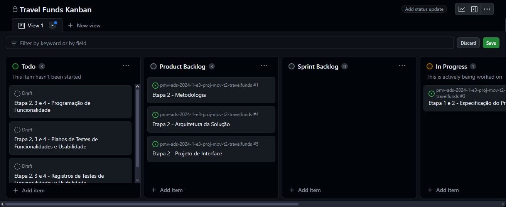
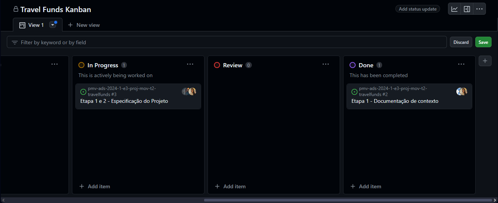

# Metodologia

 A metodologia contempla todas as ferramentas definidas pelos componentes para a manutenção dos códigos e demais artefatos, e para a organização da equipe na execução das tarefas do projeto.

## Relação de Ambientes de Trabalho

Foram utilizadas diferentes plataformas na construção dos artefatos do projeto e a relação dos ambientes com seu respectivo propósito é apresentada na tabela a seguir.

**Quadro 9 – Ambientes de Trabalho** 
| Ambiente                          | Plataforma / Link de Acesso                                                                                                                        |
| --------------------------------- | -------------------------------------------------------------------------------------------------------------------------------------------------- |
| Repositório de código fonte       | [GitHub](https://github.com/ICEI-PUC-Minas-PMV-ADS/pmv-ads-2023-2-e2-proj-int-t5-seleta/tree/main/src)                                                         |
| Documentos do projeto             | [GitHub](https://github.com/ICEI-PUC-Minas-PMV-ADS/pmv-ads-2023-2-e2-proj-int-t5-seleta/tree/main/docs) |
| Projeto de Interface e Wireframes | [Figma]() [LucidChart](https://lucid.app/lucidchart/92ee7d95-991c-4ed2-abe7-008521b1935e/edit?viewport_loc=-866%2C-5266%2C1474%2C863%2Cag3fl1WapyEI&invitationId=inv_6ec0e362-a9e8-4b42-a736-bdb0c28254dd) |
| Gerenciamento do Projeto          | [GitHub Projects](https://github.com/orgs/ICEI-PUC-Minas-PMV-ADS/projects/807) |

**Fonte**: Elaborado pelos autores. 

## Controle de Versão

A ferramenta de controle de versão adotada no projeto foi o
[Git](https://git-scm.com/), sendo que o [Github](https://github.com)
foi utilizado para hospedagem do repositório.

O projeto segue a seguinte convenção para o nome de branches:

- `main`: versão estável já testada do software
- `dev`: versão de desenvolvimento do software
- `bugfix`: ajustes de bugs do software
- `feature`: novas features do software

Quanto à gerência de issues, o projeto adota a seguinte convenção para
etiquetas:

- `documentation`: melhorias ou acréscimos à documentação
- `bug`: uma funcionalidade encontra-se com problemas
- `enhancement`: uma funcionalidade precisa ser melhorada
- `feature`: uma nova funcionalidade precisa ser introduzida

 

A branch principal é a main, em que estará a versão estável da aplicação. Já na branch dev, serão armazenadas as modificações feitas pela equipe de desenvolvimento. Na branch testing, todas as alterações serão enviadas, sem erros, para serem testadas nessa branch.

Para a criação de novas funcionalidades da aplicação, será usada a convenção de <b>feature</b> seguida por uma breve descrição da tarefa pra uma melhor forma de identificar a branch. Já para a correção de bugs, a 
convenção usada será <b>bugfix</b> que carregará o nome da issue que está sendo resolvida.

## Gerenciamento de Projeto

### Divisão de Papéis

Para realizar o gerenciamento do projeto, os alunos optaram em utilizar o Scrum como metodologia ágil.  

A equipe foi organizada da seguinte maneira: 

- Scrum Master: Ana Carolina Nazareth.
- Product Owner: Victor Bastos.
- Equipe de Desenvolvimento: Gabriela Penaforte, Naianna Duarte, Felipe de Araújo e Nikita Ceccon.

### Processo

Para uma melhor organização, distribuição e acompanhamento das tarefas do projeto, foi utilizado o Trello. A ferramenta foi estruturada com as seguintes listas:

- Product Backlog: lista de requisitos e demais tarefas identificadas no decorrer do projeto.  
- Sprint Backlog: consta as tarefas que devem ser trabalhadas no momento.  
- In Progress: relação de tarefas que estão sendo trabalhadas.  
- Review: tarefas que estão sendo revisadas, passando por testes e controle de qualidade.  
- Done: tarefas que foram concluídas, aprovadas e estão prontas para serem entregues ao usuário.

   

 
<b>Figura</b>- Tela do kanban utilizada pelo grupo
  
 

  

 
<b>Figura  </b>- Tela do kanban utilizada pelo grupo
  

### Ferramentas

As ferramentas empregadas no projeto são:

- Editor de código: Visual Studio Code
- Gerenciamento e repósitorio de código: GitHub
- Ferramentas de comunicação: Whatsapp e Microsoft Teams
- Gerenciamento de tarefas e equipe: GitHub Projects
- Ferramentas de desenho de tela (_wireframing_): Figma

O editor de código foi escolhido porque ele possui uma integração com o sistema de versão. As ferramentas de comunicação utilizadas possuem integração semelhante e por isso foram selecionadas. Por fim, para criar diagramas utilizamos essa ferramenta por melhor captar as necessidades da nossa solução.
