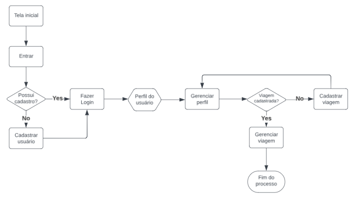

# Projeto de Interface

 O projeto de interface do aplicativo visa proporcionar uma experiência intuitiva e eficiente aos usuários, simplificando o processo de registro e acompanhamento das despesas relacionadas a viagens. Ao longo das telas do sistema, os usuários encontrarão uma interface limpa e organizada, com elementos de design que facilitam a identificação e utilização das funcionalidades essenciais. 

## Diagrama de Fluxo

 O fluxo de interação do usuário pelas telas do sistema é mostrado no fluxograma visto na Figura 8. Cada uma das telas deste fluxo é detalhada na seção de Wireframes a seguir. 

 

  
<b>Figura 7 </b>- Diagrama de fluxo

## Wireframes

São protótipos usados em design de interface para sugerir a estrutura de um site web e seu relacionamentos entre suas páginas. Um wireframe web é uma ilustração semelhante do layout de elementos fundamentais na interface.
 
> **Links Úteis**:
> - [Protótipos vs Wireframes](https://www.nngroup.com/videos/prototypes-vs-wireframes-ux-projects/)
> - [Ferramentas de Wireframes](https://rockcontent.com/blog/wireframes/)
> - [MarvelApp](https://marvelapp.com/developers/documentation/tutorials/)
> - [Figma](https://www.figma.com/)
> - [Adobe XD](https://www.adobe.com/br/products/xd.html#scroll)
> - [Axure](https://www.axure.com/edu) (Licença Educacional)
> - [InvisionApp](https://www.invisionapp.com/) (Licença Educacional)
