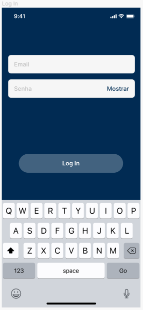
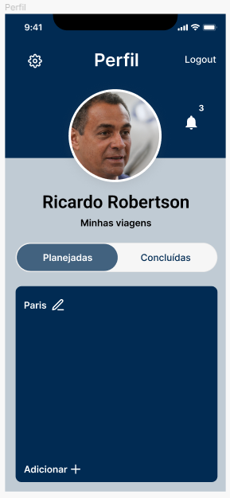
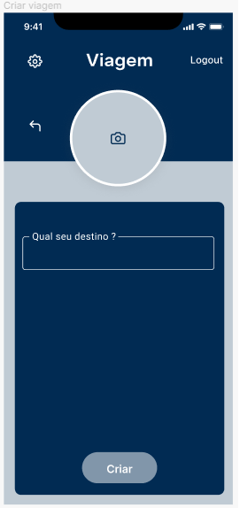
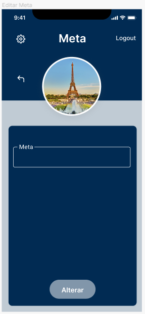
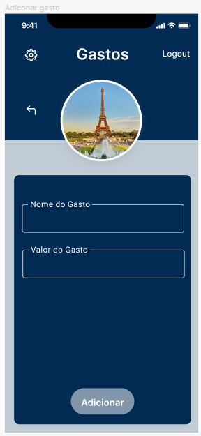
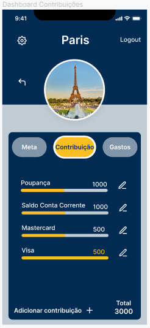
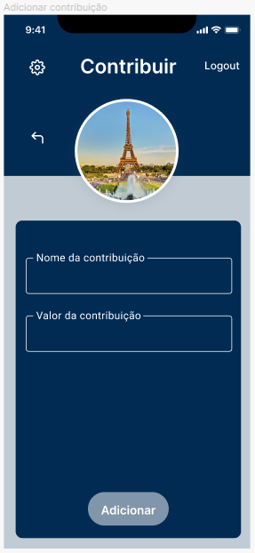
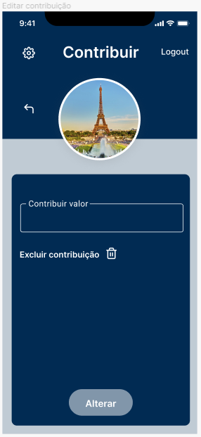
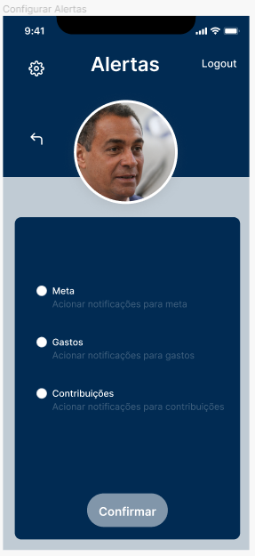

# Projeto de Interface

 O projeto de interface do aplicativo visa proporcionar uma experiência intuitiva e eficiente aos usuários, simplificando o processo de registro e acompanhamento das despesas relacionadas a viagens. Ao longo das telas do sistema, os usuários encontrarão uma interface limpa e organizada, com elementos de design que facilitam a identificação e utilização das funcionalidades essenciais. 

## Diagrama de Fluxo

 O fluxo de interação do usuário pelas telas do sistema é mostrado no fluxograma visto na Figura 8. Cada uma das telas deste fluxo é detalhada na seção de Wireframes a seguir. 

 

  
<b>Figura 7 </b>- Diagrama de fluxo

## Wireframes

<table >
    <tr >
       <th>Landing</th>
       <th>Cadastro</th>
       <th>Login</th>
    </tr>
    <tr>
    <td width="300" >
       
    </td>
      <td width="300" >
        
    </td>
       <td width="300" >
       
    </td>
    </tr>
</table>

<table >
    <tr >
       <th>Perfil</th>
       <th>Configurar Perfil</th>
       <th>Criar Viagem</th>
    </tr>
    <tr>
    <td width="300" >
         
    </td>
    <td width="300" >
         
    </td>
    <td width="300" >
        
    </td>
    </tr>
</table>

<table>
    <tr>
       <th>Viagem Main</th>
       <th>Dashboard Meta</th>
       <th>Editar Meta</th>
    </tr>
    <tr>
    <td width="300" >
         
    </td>
    <td width="300" >
         
    </td>
    <td width="300" >
       
    </td>
    </tr>
</table>

<table>
    <tr>
       <th>Dashboard Gastos</th>
       <th>Adicionar Gastos</th>
       <th>Editar Gastos</th>
    </tr>
    <tr>
    <td width="300" >
         
    </td>
    <td width="300" >
         
    </td>
    <td width="300" >
        
    </td>
    </tr>
</table>

<table>
    <tr>
       <th>Dashboard Contribuições</th>
       <th>Adicionar Contribuição</th>
       <th>Editar Contribuição</th>
    </tr>
    <tr>
    <td width="300" >
        
    </td>
    <td width="300" >
         
    </td>
    <td width="300" >
        
    </td>
    </tr>
</table>

<table>
    <tr>
       <th>Compartilhar viagem</th>
       <th>Configurar Alertas</th>
       <th>Alertas</th>
    </tr>
    <tr>
    <td width="300" >
       
    </td>
    <td width="300" >
        
    </td>
    <td width="300" >
       
    </td>
    </tr>
</table>
