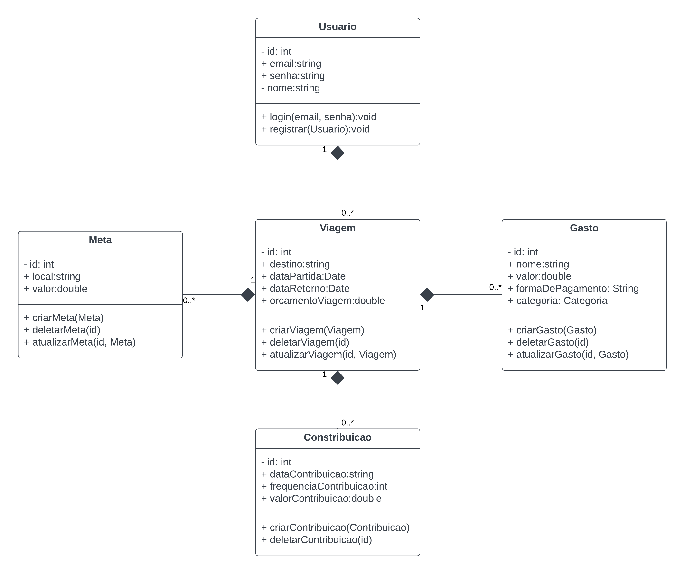
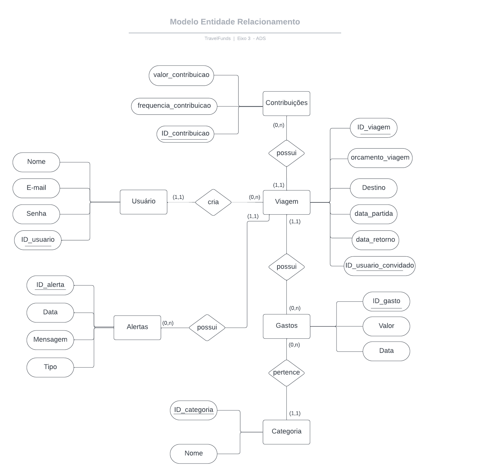
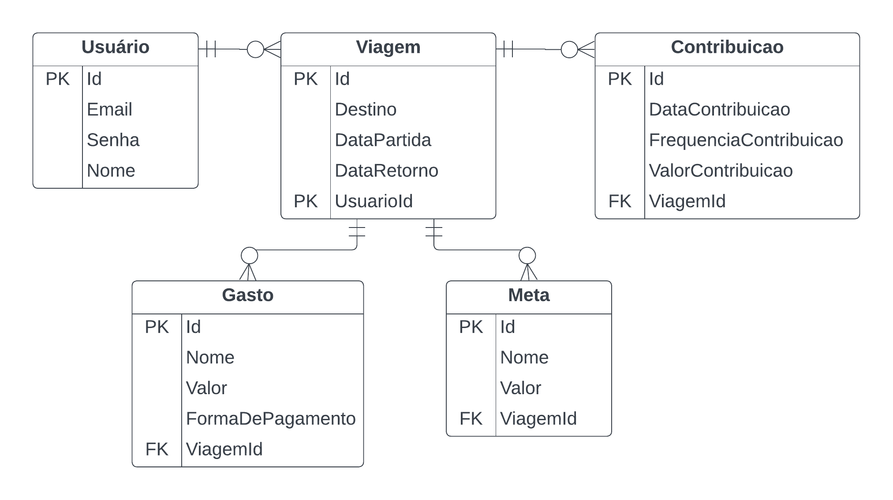

# Arquitetura da Solução

Definição de como o software é estruturado em termos dos componentes que fazem parte da solução e do ambiente de hospedagem da aplicação.

## Diagrama de Classes

O diagrama de classes ilustra graficamente como será a estrutura do software, e como cada uma das classes da sua estrutura estarão interligadas. Essas classes servem de modelo para materializar os objetos que executarão na memória.

  
<b>Figura 9 </b>- Diagrama de Classes

## Modelo ER

O Modelo ER representa através de um diagrama como as entidades (coisas, objetos) se relacionam entre si na aplicação interativa.

  

  
<b>Figura 10 </b>- Modelo ER

## Esquema Relacional

O Esquema Relacional corresponde à representação dos dados em tabelas juntamente com as restrições de integridade e chave primária.

  
<b>Figura 11 </b>- Esquema relacional

## Modelo Físico

Arquivo banco.sql contendo os scripts de criação das tabelas do banco de dados se encontra no diretorio <a href="../src/db/banco.sql">src/db</a>.

## Tecnologias Utilizadas

- C#
- ASP.NET
- Entity Framework
- SQL Server
- HTML/CSS
- Javascript
- React Native
- Azure
- Visual Studio/Visual Studio Code

## Hospedagem

A API do sistema, assim como o banco de dados será hospedada nos servidores da plataforma de computação em nuvem Microsoft Azure.

## Qualidade de Software

#### Adequação funcional:

Integridade funcional: O software deve ser capaz de manter a funcionalidade de todas as tarefas que realiza.

#### Confiabilidade:

Disponibilidade: O software e seus componentes devem estar acessíveis e operantes sempre que necessário, para que o usuário tenha controle das suas metas e gastos.

Maturidade: Certificar-se de que o aplicativo seja confiável e livre de falhas significativas.

Tolerância a falhas: Minimizar interrupções causadas por falhas no sistema e garantir que o aplicativo continue funcionando de forma adequada mesmo em situações de falha.

### Usabilidade:

Apreensibilidade: Certificar-se de que a interface do usuário seja fácil de entender.

Operacionalidade: Garantir que o aplicativo seja fácil de utilizar e controlar as operações.

#### Eficiência de Desempenho:

Comportamento temporal: Garantir que o aplicativo responda rapidamente às interações dos usuários.

Utilização de recursos: Garantir que o aplicativo utilize os recursos do dispositivo de forma eficiente, com o objetivo de evitar lentidão.

### Segurança:

Confidencialidade: Proteger informações confidenciais dos usuários e dados da viagem compartilhados com a plataforma.

Integridade: Garantir que os dados não sejam corrompidos ou alterados por terceiros não autorizados.

#### Manutenibilidade:

Modificabilidade: Facilitar a manutenção e atualizações do aplicativo para adicionar novos recursos ou corrigir problemas.

Testabilidade: Garantir que as modificações não causem novos problemas.

#### Portabilidade:

Adaptabilidade: Garantir que o aplicativo funcione em diferentes dispositivos e sistemas operacionais.

