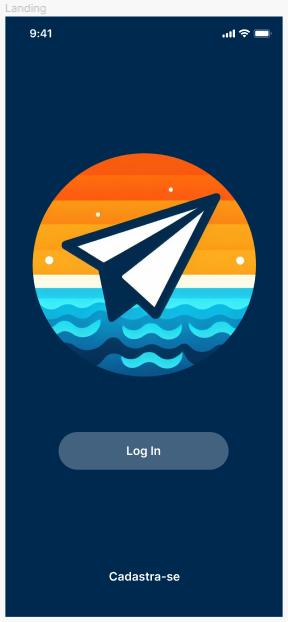
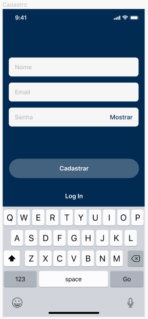

# Template Padrão da Aplicação

O layout padrão a ser utilizado pela aplicação tem correspondência ao projeto de Interface elaborado anteriormente.

## Paleta de Cores
 

 
<b>Figura </b> - Paleta de Cores

 

## Tipografia

 A fonte escolhida para a construção da interface foi a Inter, para garantir a legibilidade com um estilo moderno e uma sensação de harmonia. 
 

## Logotipo
 

 
<b>Figura</b> - Logotipo do site

 

## Telas

Todas as telas apresentam um layout responsivo, tendo seu conteúdo ajustado para qualquer tamanho de tela. 
O template criado é composto pelos seguintes layouts:
 
 - Landing
 - Cadastro
 - Login
 - Perfil
 - Criar Viagem
 - Viagem Main
 - Dashboard Meta
 - Dashboard Gastos
 - Dashboard Contribuições
 - Configurar Alertas
 - Alertas
 - Adicionar Gastos
 - Adicionar Contribuição
 - Configurar Perfil
 - Editar Meta
 - Editar Gasto
 - Editar Contribuição

 

### Tela - Landing

 

 
<b>Landing</b>

 

### Tela - Login

 
<b>Login</b>

 

 RF-001 - A aplicação deve permitir que o usuário crie uma conta

 

