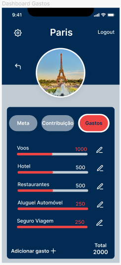

# Template Padrão da Aplicação

O layout padrão a ser utilizado pela aplicação tem correspondência ao projeto de Interface elaborado anteriormente.

## Paleta de Cores
 

 
<b>Figura </b> - Paleta de Cores

 

## Tipografia

 A fonte escolhida para a construção da interface foi a Inter, para garantir a legibilidade com um estilo moderno e uma sensação de harmonia. 
 

## Logotipo
 

 
<b>Figura</b> - Logotipo do site

 

## Telas

Todas as telas apresentam um layout responsivo, tendo seu conteúdo ajustado para qualquer tamanho de tela. 
O template criado é composto pelos seguintes layouts:
 
 - Landing
 - Cadastro
 - Login
 - Perfil
 - Criar Viagem
 - Viagem Main
 - Dashboard Meta
 - Dashboard Gastos
 - Dashboard Contribuições
 - Configurar Alertas
 - Alertas
 - Adicionar Gastos
 - Adicionar Contribuição
 - Configurar Perfil
 - Editar Meta
 - Editar Gasto
 - Editar Contribuição

 

### Tela - Landing 

 

 

 

### Tela - Cadastro

 
 RF-001 - A aplicação deve permitir que o usuário crie uma conta

 

### Tela - Login

 
 RF-002	A aplicação deve permitir que o usuário realize login em sua conta utilizando email e senha

 

### Tela - Perfil e Configurar Perfil

 
 RF-003	A aplicação deve permitir que o usuário gerencie seu perfil

 

### Tela - Criar Viagem

 RF-004	A aplicação deve possibilitar ao usuário criar e gerenciar viagens

 

### Tela - Viagem Main

 RF-005	A aplicação deve exibir um painel de controle que destaca o valor total guardado para a viagem, saldo atualizado e lista de gastos registrados divididos por categoria
 RF-012	A aplicação deve oferecer ao usuário a possibilidade de gerar relatório que exibe gastos por categoria

 

### Tela - Dashboard Gastos, Adicionar Gastos e Editar Gastos

 RF-006	A aplicação deve permitir que os usuários insiram gastos durante a viagem, especificando valor e categoria
 RF-007	A aplicação deve atualizar automaticamente o saldo quando um gasto for inserido durante a viagem

 

### Tela - Dashboard Contribuições

 RF-008	A aplicação deve permitir que os usuários registrem o valor que estão guardando para a viagem

 

### Tela - Dashboard Meta e Editar Meta

 RF-009	A aplicação deve permitir que o usuário configure um orçamento total necessário para a realização da viagem
 RF-010	A aplicação deve exibir o progresso em direção a meta de economia final

 

### Tela - ?

 RF-011	A aplicação deve permirtir que o usuário compartilhe uma viagem com outros usuários

 

### Tela - Configurar Alertas e Alerta

 RF-013	A aplicação deve permitir que os usuários programem alertas para poupança e recebam notificações durante a viagem, alertando sobre a proximidade ou ultrapassagem do limite de gastos estabelecido

 

