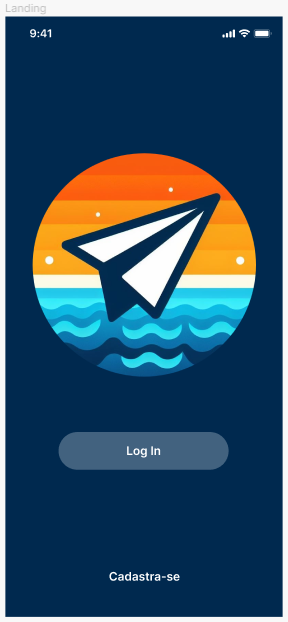

# Programação de Funcionalidades

Implementação do sistema descritas por meio dos requisitos funcionais e/ou não funcionais. Deve relacionar os requisitos atendidos os artefatos criados (código fonte) além das estruturas de dados utilizadas e as instruções para acesso e verificação da implementação que deve estar funcional no ambiente de hospedagem.

## Tela Landing

<table>
    <tr>
        <th>Landing</th>
        <th>Código Fonte</th>       
    </tr>
    <tr>
    <td width="300" >
        
    </td>
        <td width="300" >
            <a href="../src/travelfunds-app/src/screens/Home.js">Link do Código Fonte</a>
        </td>
    </tr>
</table>

## Tela Login
<table>
        <tr>
        <th>Login</th>
        <th>Código Fonte</th>       
    </tr>
    <tr>
    <td width="300" >
        
    </td>
        <td width="300" >
            <a href="../src/travelfunds-app/src/screens/Login.js">Link do Código Fonte</a>
        </td>
    </tr>
</table>

## Tela Cadastro
<table>
        <tr>
        <th>Cadastro</th>
        <th>Código Fonte</th>       
    </tr>
    <tr>
    <td width="300" >
        
    </td>
        <td width="300" >
            <a href="../src/travelfunds-app/src/screens/Cadastro.js">Link do Código Fonte</a>
        </td>
    </tr>
</table>

## Tela Perfil
<table>
        <tr>
        <th>Perfil</th>
        <th>Código Fonte</th>       
    </tr>
    <tr>
    <td width="300" >
        
    </td>
        <td width="300" >
            <a href="../src/travelfunds-app/src/screens/Perfil.js">Link do Código Fonte</a>
        </td>
    </tr>
</table>

## Tela Configurar Perfil
<table>
        <tr>
        <th>Configurar Perfil</th>
        <th>Código Fonte</th>       
    </tr>
    <tr>
    <td width="300" >
        
    </td>
        <td width="300" >
            <a href="../src/travelfunds-app/src/screens/EditarPerfil.js">Link do Código Fonte</a>
        </td>
    </tr>
</table>

## Tela Criar e Configurar Viagem
<table>
        <tr>
        <th>Criar e Configurar Viagem</th>
        <th>Código Fonte</th>       
    </tr>
    <tr>
    <td width="300" >
        
    </td>
        <td width="300" >
            <a href="../src/travelfunds-app/src/components/Perfil.js">Link do Código Fonte de Criar Viagem</a>
            <a href="../src/travelfunds-app/src/screens/EditarViagem.js">Link do Código Fonte de Configurar Viagem</a>
        </td>
    </tr>
</table>

## Tela Painel de Viagem
<table>
        <tr>
        <th>Painel de Viagem</th>
        <th>Código Fonte</th>       
    </tr>
    <tr>
    <td width="300" >
        
    </td>
        <td width="300" >
            <a href="../src/travelfunds-app/src/screens/Perfil.js">Link do Código Fonte</a>
        </td>
    </tr>
</table>

## Tela Dashboard da Meta 
<table>
        <tr>
        <th>Dashboard da Meta</th>
        <th>Código Fonte</th>       
    </tr>
    <tr>
    <td width="300" >
        
    </td>
        <td width="300" >
            <a href="../src/travelfunds-app/src/screens/Meta">Link do Código Fonte</a>
        </td>
    </tr>
</table>

## Tela Editar Meta
<table>
        <tr>
        <th>Editar Meta</th>
        <th>Código Fonte</th>       
    </tr>
    <tr>
        <td width="300" >
        
    </td>
        <td width="300" >
            <a href="../src/travelfunds-app/src/screens/Meta/EditarMeta.js">Link do Código Fonte</a>
        </td>
    </tr>
</table>

## Tela Dashboard dos Gastos
<table>
        <tr>
        <th>Dashboard dos Gastos</th>
        <th>Código Fonte</th>       
    </tr>
    <tr>
    <td width="300" >
        
    </td>
        <td width="300" >
            <a href="../src/travelfunds-app/src/screens/Gasto">Link do Código Fonte</a>
        </td>
    </tr>
</table>

## Tela Editar Gastos
<table>
        <tr>
        <th>Editar Gastos</th>
        <th>Código Fonte</th>       
    </tr>
    <tr>
        <td width="300" >
        
    </td>
        <td width="300" >
            <a href="../src/travelfunds-app/src/screens/Gasto/EditarGasto.js">Link do Código Fonte</a>
        </td>
    </tr>
</table>

## Tela Dashboard de Contribuições
<table>
        <tr>
        <th>Dashboard de Contribuições</th>
        <th>Código Fonte</th>       
    </tr>
    <tr>
    <td width="300" >
        
    </td>
        <td width="300" >
            <a href="../src/travelfunds-app/src/screens/Contribuicao">Link do Código Fonte</a>
        </td>
    </tr>
</table>

## Tela Editar Contribuições
<table>
        <tr>
        <th>Editar Contribuições</th>
        <th>Código Fonte</th>       
    </tr>
    <tr>
        <td width="300" >
        
    </td>
        <td width="300" >
            <a href="../src/travelfunds-app/src/screens/Contribuicao/EditarContribuicao.js">Link do Código Fonte</a>
        </td>
    </tr>
</table>
